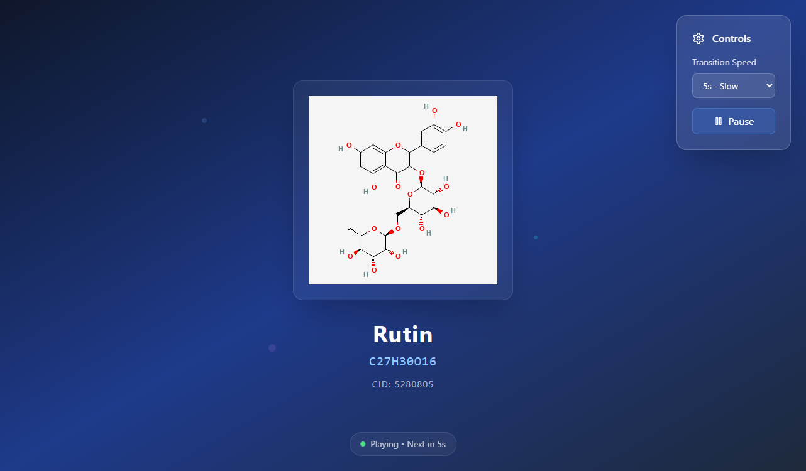

# 🧬 Molecular Structure Animation

An interactive web application for visualizing and animating molecular structures, built with React, TypeScript, and modern web technologies.

[](http://molecular.pages.dev/)
[](LICENSE)
[](https://www.typescriptlang.org/)
[](https://reactjs.org/)

## 📸 Preview



*Interactive visualization of Rutin (C27H30O16) with animation controls and molecular information display*

## ✨ Features

- 🎨 **Interactive Molecular Visualization**: Explore molecular structures with smooth, real-time animations
- 🔄 **Dynamic Animation Controls**: Adjust rotation speed, direction, and animation parameters
- 📱 **Responsive Design**: Works seamlessly on desktop, tablet, and mobile devices
- 🎯 **Educational Focus**: Perfect for students, educators, and chemistry enthusiasts
- 🌟 **Screensaver Mode**: Beautiful molecular animations for ambient display
- ⚙️ **Customizable Settings**: Personalize your viewing experience with various options
- 🎭 **Multiple Molecules**: Pre-loaded library of common molecular structures
- 🔬 **Scientific Accuracy**: Accurate representation of molecular geometry and bonds

## 🚀 Quick Start

### Prerequisites

- Node.js (v16.0.0 or higher)
- npm or yarn package manager

### Installation

1. **Clone the repository**
   ```bash
   git clone https://github.com/yuis-ice/molecular-structure-animation.git
   cd molecular-structure-animation
   ```

2. **Install dependencies**
   ```bash
   npm install
   ```

3. **Start the development server**
   ```bash
   npm run dev
   ```

4. **Open your browser**
   Navigate to `http://localhost:5173` to see the application running.

## 🛠️ Available Scripts

- `npm run dev` - Start the development server with hot reload
- `npm run build` - Build the project for production
- `npm run preview` - Preview the production build locally
- `npm run lint` - Run ESLint to check code quality

## 🏗️ Project Structure

```
src/
├── components/           # React components
│   ├── MolecularDisplay.tsx    # Main molecular visualization component
│   ├── MolecularScreensaver.tsx # Screensaver mode component
│   └── SettingsPanel.tsx       # Settings and controls panel
├── data/                # Static data and configurations
│   └── molecules.ts           # Molecular structure definitions
├── hooks/               # Custom React hooks
│   └── useLocalStorage.ts     # Local storage management hook
├── types/               # TypeScript type definitions
│   └── molecule.ts            # Molecular structure types
├── App.tsx              # Main application component
├── main.tsx             # Application entry point
└── index.css            # Global styles and Tailwind imports
```

## 🧬 Molecular Data Structure

The application uses a standardized format for molecular data:

```typescript
interface Molecule {
  id: string;
  name: string;
  formula: string;
  atoms: Atom[];
  bonds: Bond[];
  description?: string;
}

interface Atom {
  id: string;
  element: string;
  position: [number, number, number];
  color?: string;
}

interface Bond {
  id: string;
  atomIds: [string, string];
  type: 'single' | 'double' | 'triple';
}
```

## 🎮 Usage

### Basic Navigation
- **Rotation**: Molecules automatically rotate for optimal viewing
- **Settings Panel**: Click the settings icon to access customization options
- **Screensaver Mode**: Enable for continuous ambient molecular animations

### Customization Options
- Adjust rotation speed and direction
- Toggle between different molecular structures
- Customize visual appearance and colors
- Enable/disable various display elements

## 🤝 Contributing

We welcome contributions from the community! Please see our [Contributing Guide](CONTRIBUTING.md) for details on how to get started.

### Quick Contributing Steps
1. Fork the repository
2. Create a feature branch (`git checkout -b feature/amazing-feature`)
3. Make your changes
4. Commit your changes (`git commit -m 'Add some amazing feature'`)
5. Push to the branch (`git push origin feature/amazing-feature`)
6. Open a Pull Request

## 🐛 Bug Reports & Feature Requests

- **Bug Reports**: Please use our [Bug Report Template](.github/ISSUE_TEMPLATE/bug_report.yml)
- **Feature Requests**: Please use our [Feature Request Template](.github/ISSUE_TEMPLATE/feature_request.yml)
- **General Discussion**: Visit our [GitHub Discussions](https://github.com/yuis-ice/molecular-structure-animation/discussions)

## 🧪 Technology Stack

- **Framework**: React 18.3+
- **Language**: TypeScript 5.5+
- **Build Tool**: Vite 5.4+
- **Styling**: Tailwind CSS 3.4+
- **Icons**: Lucide React
- **Linting**: ESLint with TypeScript support

## 📚 Educational Applications

This project is perfect for:

- **Chemistry Education**: Visualizing molecular structures and chemical bonds
- **Interactive Learning**: Hands-on exploration of molecular geometry
- **Presentations**: Engaging visual aids for chemistry lessons
- **Research**: Quick visualization of molecular compounds
- **Self-Study**: Independent learning and exploration

## 🌟 Supported Molecules

The application includes pre-configured data for common molecules:

- Water (H₂O)
- Carbon Dioxide (CO₂)
- Methane (CH₄)
- Ammonia (NH₃)
- Benzene (C₆H₆)
- Caffeine (C₈H₁₀N₄O₂)
- And many more...

## 🚀 Deployment

The application is deployed and available at: [http://molecular.pages.dev/](http://molecular.pages.dev/)

### Building for Production

```bash
npm run build
```

The built files will be in the `dist/` directory, ready for deployment to any static hosting service.

## 📄 License

This project is licensed under the MIT License - see the [LICENSE](LICENSE) file for details.

## 🙏 Acknowledgments

- Thanks to the chemistry education community for inspiration
- Built with modern web technologies and best practices
- Designed for accessibility and cross-platform compatibility

## 📞 Support

If you encounter any issues or have questions:

1. Check the [existing issues](https://github.com/yuis-ice/molecular-structure-animation/issues)
2. Join our [discussions](https://github.com/yuis-ice/molecular-structure-animation/discussions)
3. Create a new issue using the appropriate template

---

**Made with ❤️ for the chemistry education community**

*Explore the fascinating world of molecular structures through interactive visualization!*